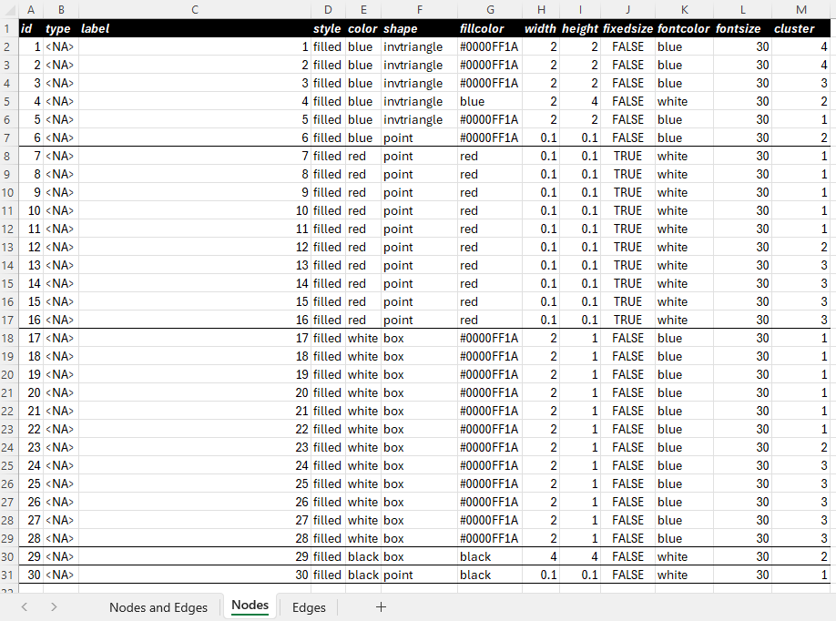
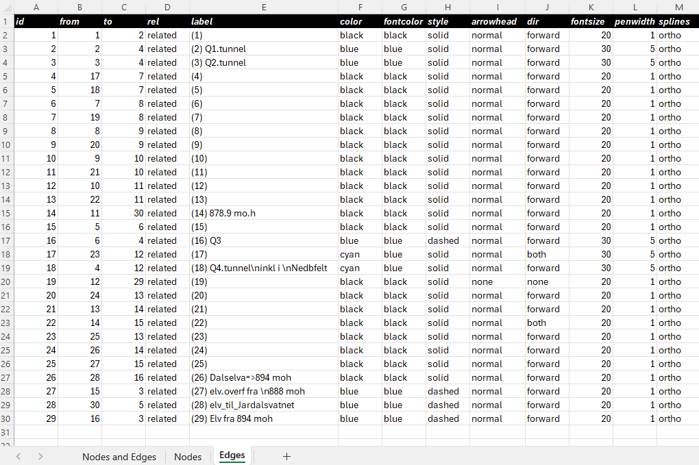

```{r setup, include = FALSE}
knitr::opts_chunk$set(
  collapse = TRUE,
  comment = "#>"
)
```

# What does the package do?

# Loading the package and dependecises and the documentation (vignette)

```{r}
#the package
library(JEMtools) 

#dependencies
library(DiagrammeR)
library(readxl)
library(kableExtra)

#The the documentation (vignette)
vignette("JEMtools",package = "JEMtools")
```

# Creating flow charts from edegs and nodes data in an excel file

## fx.draw.system

```{r}
#| warning: false
#| message: false
#| out-width: 100%
#| fig-height: 8

#load some included flow charts nodes and edges data
Flowchart_Nodes_and_edges.xlsx <- system.file("data/Flowchart_Nodes_and_edges.xlsx",package = "JEMtools")
#view nodes data
#kable(read_xlsx(Flowchart_Nodes_and_edges.xlsx,sheet = 1))

#view edges
#kable(read_xlsx(Flowchart_Nodes_and_edges.xlsx,sheet = 2))

fx.draw.system(nodes_edges_xls = Flowchart_Nodes_and_edges.xlsx,
               rankdir = "TB")
```

## fx.draw.system.clusters


```{r}
#| warning: false
#| message: false
#| out-width: 100%
#| fig-height: 8

#load some included flow charts nodes and edges data
Flowchart_Nodes_and_edges.xlsx <- system.file("data/Flowchart_Nodes_and_edges.xlsx",package = "JEMtools")
fx.draw.system.clusters(nodes_edges_xls = Flowchart_Nodes_and_edges.xlsx,
               rankdir = "TB")
```

# HBV Model Functions

```{r}
#| label: r_setup_hbv
#| code-fold: true
#| results: hide
#| message: false
#| warning: false
#| echo: false
#| 
cat("\014") # empty console
#load functions
#source("D:/WORK/Tools/R/Packages/JEMtools/R/JEMtools_functions.R", echo=TRUE) 
#library(JEMtools)
graphics.off() # close all graphics devices
#input the data
input<-fx.hbv.daily.getdata(dir="D:/WORK/Tools/R/Packages/JEMtools/data/hbv",
                            Timeseries ="Timeseries.txt",
                            Free_Par.txt="Free_Par.txt",
                            Fixed_Par.txt="Fixed_Par.txt",
                            serie.start.date="2020-09-01")

fig.hgt.series = 5
fig.hgt.parallel = length(input$data$hyear)*(fig.hgt.series-1)

#access the data included in the package
system.file("extdata/hbv","Timeseries.txt",package = "JEMtools")
system.file("extdata/hbv","Fixed_Par.txt",package = "JEMtools")
system.file("extdata/hbv","Free_Par.txt",package = "JEMtools")
```

## Serial

### Calibration mode (all years)

```{r,fig.height=fig.hgt.series}
#| label: fig.serial_calib_mode
#| code-fold: true
#| fig-cap: Serial run | Simulation mode 
#| out-width: 100%
#| message: false
#| warning: false
#| echo: true
#| results: hide
#| 
prm<-input$data$fri[,2] #get the parameters
#Function runs the model and returns the objectuve criteria
calib.serial.out<-fx.hbv.model.serial(prm=prm,
                                      input=input,
                                      Snow2GlacierOption = TRUE,
                                      Snow2GlacierJulianDate= as.Date(2020-09-01),
                                      calibrate=TRUE,
                                      obj.criteria = "NSE",
                                      calib.plots = TRUE,
                                      icall = 1)
```

### Simulation mode (all years)

```{r,fig.height=fig.hgt.series}
#| label: fig.serial_simulation_mode
#| code-fold: true
#| fig-cap: Serial run | Simulation mode
#| out-width: 100%
#| message: false
#| warning: false
#| echo: true
#| results: hide

prm<-input$data$fri[,2] #get the parameters
#Function runs the model and returns the complete data from the simulation
Sim.serial.out<-fx.hbv.model.serial(prm=NULL,
                                        input=input,
                                        Snow2GlacierOption = TRUE,
                                        Snow2GlacierJulianDate= as.Date(2020-09-01),
                                        calibrate=FALSE,
                                        obj.criteria = "NSE",
                                        calib.plots = TRUE,
                                        icall = 1)
```

## Parallel

### Calibration mode (Parallel - by hydrological year)

```{r ,fig.height= fig.hgt.parallel}
#| label: fig.Serial_Calibration_mode
#| code-fold: true
#| fig-cap: Parallel run | Calibration mode
#| out-width: 100%
#| message: false
#| warning: false
#| echo: true
#| results: hide

prm<-input$data$fri[,2] #get the parameters
#Function runs the model and returns the complete data from the simulation
calib.parallel.out<-fx.hbv.model.parallel(prm=NULL,
                                        input=input,
                                        Snow2GlacierOption = TRUE,
                                        Snow2GlacierJulianDate= as.Date("2020-09-01"),
                                        calibrate=TRUE,
                                        obj.criteria = "NSE",
                                        calib.plots = TRUE,
                                        icall = 1)


```

### Simulation mode (Parallel - by hydrological year)

```{r,fig.height= fig.hgt.parallel}
#| label: fig.Parallel_Simulation_mode
#| code-fold: true
#| fig-cap: Parallel run | Simulation mode
#| out-width: 100%
#| message: false
#| warning: false
#| echo: true
#| results: hide

prm<-input$data$fri[,2] #get the parameters
#Function runs the model and returns the complete data from the simulation
Sim.parallel.out<-fx.hbv.model.parallel(prm=NULL,
                                            input=input,
                                            Snow2GlacierOption = TRUE,
                                            Snow2GlacierJulianDate= as.Date("2020-09-01"),
                                            calibrate=FALSE,
                                            obj.criteria = "NSE",
                                            calib.plots = TRUE,
                                            icall = 1)
```

## Alaternative serial plots

```{r}
#| label: fig.ggplot
#| code-fold: true
#| fig-cap: Serial run | Simulation mode - ggplot
#| out-width: 100%
#| fig-height: 4
#| message: false
#| warning: false
#| echo: true
#| results: hide
Time<-Sim.serial.out$Lumped$Time
Qsim<-Sim.serial.out$Lumped$Qsim
Qobs<-Sim.serial.out$Lumped$Qobs
Prec<-Sim.serial.out$Lumped$Precipitation
fx.ggplot.Qobs.Qsim.Time(Qsim,Qobs,Time,Prec)
```

## Interactive serial plots

```{r}
#| label: fig.highcharter
#| code-fold: true
#| fig-cap: Serial run | Simulation mode - ggplot
#| out-width: 100%
#| fig-height: 8
#| message: false
#| warning: false
#| echo: true
Time<-Sim.serial.out$Lumped$Time
Qsim<-Sim.serial.out$Lumped$Qsim
Qobs<-Sim.serial.out$Lumped$Qobs
Prec<-Sim.serial.out$Lumped$Precipitation
#hc<-fx.highchart.hbv(Qsim,Qobs,Time,Prec,xts=T,theme = 1)
d<-data.frame(Time,Qobs,Qsim,Prec)
plot.title<-paste(paste(names(Sim.serial.out$objective.criteria),"=",round(Sim.serial.out$objective.criteria,2)),collapse="|")
hc<-fx.highchart.many.series.and.yaxes(data_timeseries = d,
                                       x =1,
                                       y0 = 2:3,
                                       y1 = 4,
                                       cols0 = c("blue","red"),
                                       cols1 = c("grey50"),
                                       type0 = c("spline","spline"),
                                       type1 = "column",
                                       y0max = 1.2,
                                       y1max=4,
                                       main=plot.title)
hc
```


# Solving connected Reservoirs

# Drawing maps
